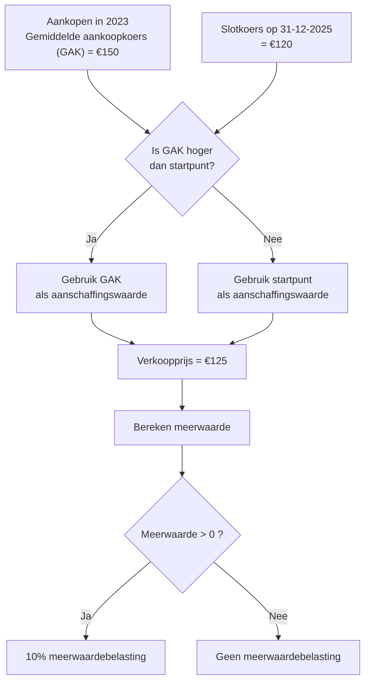

# Berekening meerwaardebelasting, Bolero example 1

```mermaid
flowchart TD

    A["Aankopen in 2023<br/>Gemiddelde aankoopkoers (GAK) = €150"]

    B["Slotkoers op 31-12-2025<br/>= €120"]

    C{"Is GAK hoger<br/>dan startpunt?"}

    D["Gebruik GAK<br/>als aanschaffingswaarde"]

    E["Gebruik startpunt<br/>als aanschaffingswaarde"]

    F["Verkoopprijs = €125"]

    G["Bereken meerwaarde"]

    H{"Meerwaarde > 0 ?"}

    I["10% meerwaardebelasting"]

    J["Geen meerwaardebelasting"]

    A --> C
    B --> C

    C -->|Ja| D
    C -->|Nee| E

    D --> F
    E --> F

    F --> G
    G --> H

    H -->|Ja| I
    H -->|Nee| J
```
